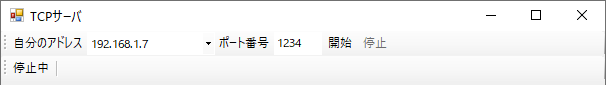
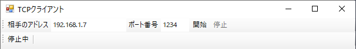

# IpSocketToolBar
IPソケット通信ツールバー (Windows Forms) とソケット通信のためのクラスライブラリ

## ツールバー類のクラス

ToolStripクラスを継承しています。 

|  名前  |  説明  |
| ---- | ---- |
| [TcpClientToolStrip](README/TcpClientToolStrip.md)  |  TCPクライアントのツールバー |
| [TcpServerToolStrip](README/TcpServerToolStrip.md)  |  TCPサーバのツールバー |
| [UdpSenderToolStrip](README/UdpSenderToolStrip.md)  |  UDP送信器のツールバー |
| [UdpReceiverToolStrip](README/UdpReceiverToolStrip.md)  |  UDP受信器のツールバー |
| [StatusToolStrip](README/StatusToolStrip.md)  |  TCP通信のステータス表示のツールバー |

## ソケット通信のためのクラス

|  名前  |  説明  |
| ---- | ---- |
| [TcpClientSocket](README/TcpClientSocket.md)  | TCPクライアントソケット |
| [TcpServerSocket](README/TcpServerSocket.md)  | TCPサーバーソケット |
| [UdpSenderSocket](README/UdpSenderSocket.md)  | UDP送信器ソケット |
| [UdpReceiverSocket](README/UdpReceiverSocket.md)  | UDP受信器ソケット |
| [PacketPayload](README/PacketPayload.md)  | IPパケットのペイロード |

※ TCP送受信はストリームではなくパケット単位で一つの電文として扱うことを想定した仕様です。

## 列挙型

|  名前  |  説明  |
| ---- | ---- |
|  AsciiCode  |  アスキー制御キャラクタコード  |
|  Endian  |  ビッグエンディアンかリトルエンディアンか  |

