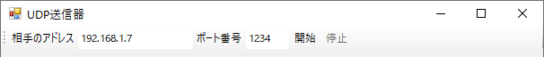

# UdpSenderToolStrip
UDP送信器のツールバーです。ToolStripクラスを継承しています。

## イベント
|  名前  |  説明  |
| ---- | ---- |
|  Opened  |  ソケットを開いたとき  |
|  Closed  |  ソケットを閉じたとき  |

## プロパティ
|  名前  |  説明  |
| ---- | ---- |
|  Scoket  |  ソケット (UdpSenderSocketクラスのオブジェクト)  |
|  UdpReceiverBar  | ペアになるUDP受信のツールバー (UdpReceiverToolStripクラスのオブジェクト) |

## メソッド
|  名前  |  説明  |
| ---- | ---- |
|  Begin(iniFileName, section, port)  |  初期化処理。  フォームの開始時(Loadイベント)に呼んでください。  iniFileName: 設定INIファイルのパス(省略可) section: 設定INIファイルのセクション名(省略可) port: 既定のポート番号(省略可) |
|  End()  |  終了処理。  フォームの終了時(FormClosingイベント)に呼んでください。 |
|  Open()  |  ソケットを開きます。開始ボタンを押すのと同じ動作です。 |
|  Close()  |  ソケットを閉じます。停止ボタンを押すのと同じ動作です。 |
